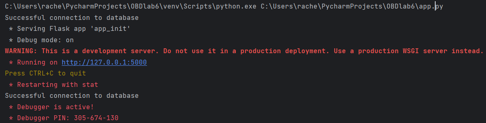
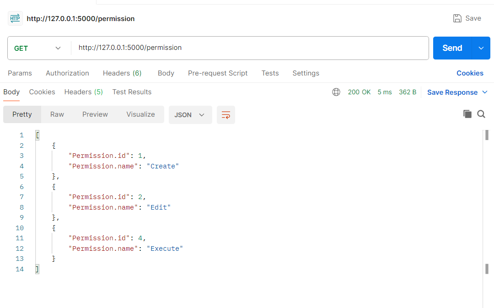
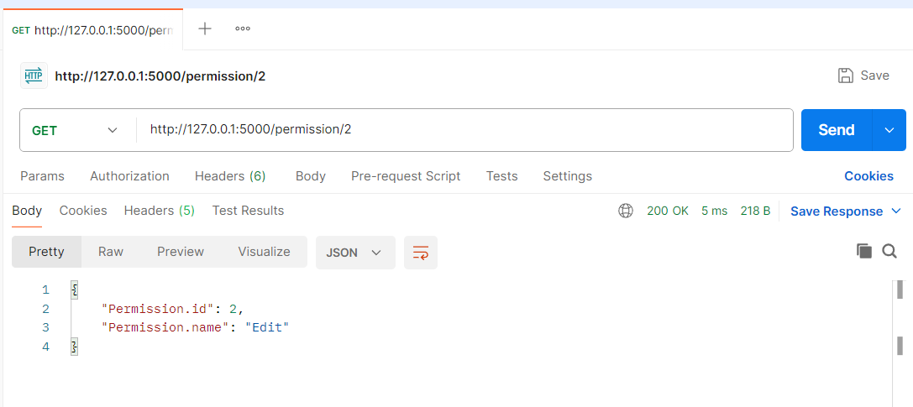
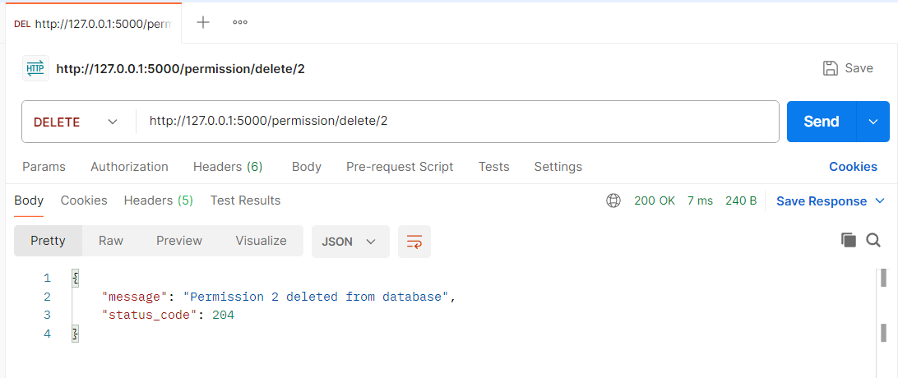
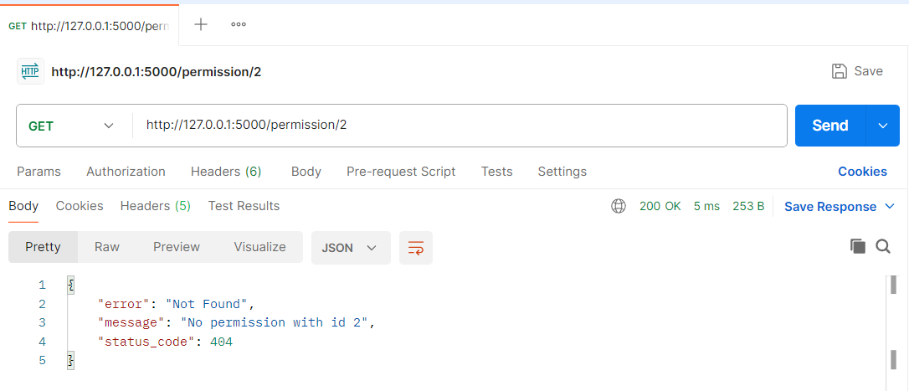

# Тестування працездатності системи

*В цьому розділі вказуються засоби тестування, наводяться вихідні коди тестів та результати тестування.*  
*Тестування виконується за допомогою Postman*

## Запуск сервера

## Тестування GET

### Отримати дозволи

### Отримати дозвіл по id

## Тестування DELETE

### Видалити дозвіл по id

#### Перевірка за допомогою GET:

